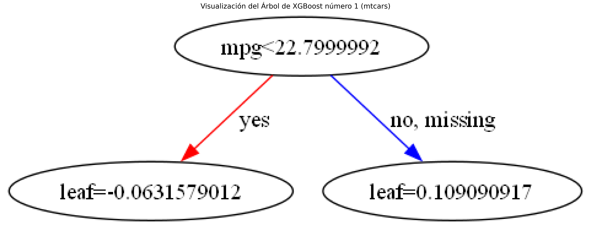

# Econometría II

Esta carpeta contiene scripts y proyectos relacionados con la materia de Econometría II.

## Contenido

### 1. Red Neuronal para Clasificación de Cilindros (`red-neuronal-mtcars.py`)

Este script implementa un **Perceptrón Multicapa (MLP)** para clasificar el número de cilindros (`cyl`) de los automóviles del dataset `mtcars`.

- **Objetivo**: Aprender a construir, entrenar y evaluar una red neuronal para un problema de clasificación multiclase.
- **Librerías**: `scikit-learn`, `pandas`, `matplotlib`, `seaborn`.
- **Conceptos clave**:
    - Preprocesamiento de datos (escalado).
    - Pipelines en `scikit-learn` para evitar fuga de información.
    - Arquitectura de un MLP (capas, neuronas, funciones de activación).
    - Evaluación de modelos de clasificación (matriz de confusión, curva de pérdida, etc.).

### 2. XGBoost para Clasificación de Cilindros (`xgboost-mtcars.py`)

Este script utiliza **XGBoost**, un potente algoritmo de gradient boosting, para el mismo problema de clasificación de cilindros en el dataset `mtcars`.

- **Objetivo**: Implementar un modelo de XGBoost y visualizar los árboles de decisión que lo componen.
- **Librerías**: `xgboost`, `pandas`, `matplotlib`, `seaborn`.
- **Conceptos clave**:
    - Preparación de datos para XGBoost (`DMatrix`).
    - Entrenamiento de un modelo de XGBoost.
    - Visualización de los árboles de decisión para interpretar el modelo.

## Cómo Ejecutar los Scripts

1. Asegúrate de tener instaladas las librerías del `requirements.txt` del repositorio principal.
2. Navega a la carpeta `src` de esta materia:
   ```bash
   cd econometria-2/src
   ```
3. Ejecuta el script que desees:
   ```bash
   python red-neuronal-mtcars.py
   ```
   o
   ```bash
   python xgboost-mtcars.py
   ```

## Visualizaciones Generadas

El script `xgboost-mtcars.py` genera visualizaciones de los árboles de decisión. Aquí tienes una muestra:

